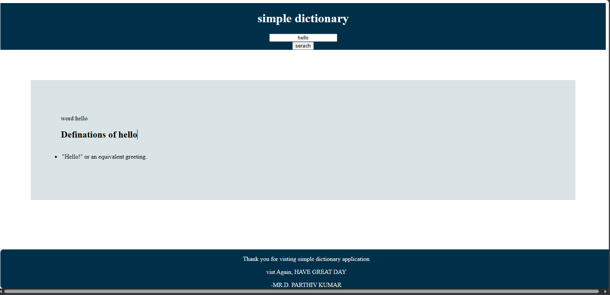
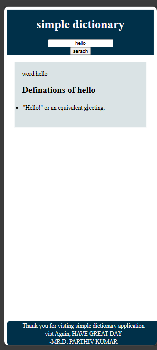

# simple Dictionary 
--
this is a simple dictionary application ,through this application we can get definitaions of word,which is you sreach in textflied .

---
 ## features
---
-Good user interface  and user friendly application .
- fast fecting the data from the API .
---

 ## technologies
I used to bulid this  application by using of React Js, for styling the application with css .
The topices the react js I  use [use state, feacting method ]. 

 --
## usage
---
Bascially this application finding definations of a word.
the application can useful for everyone.

---
## how to run programme
- copy the git clone
 - by using of git commands run clone in ternimal
 - open the index.html in your boswer.
   or
   By givien link of application you can use .

   --
### update
 I will improve  UI and update the data 

### what i learn in this application 
--
In this application I learnt lot of topice in react js .
I have improved my css {flex, responsive topices }.
how to render the data in UI from feacted API ./ I use API from dictionary apis .

-
 ## author
 - Parthiv kumar 
 - https://github.com/Parthiv-tech-git/Dictionary  
 [link of application](https://dictionary1-black.vercel.app/)
 ---
 ## output 
--

---
 

